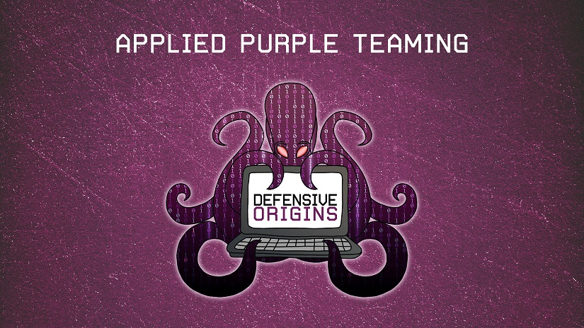

# Applied Purple Teaming 

## Course Pre-Requisites

The following pre-requisites are required before the first day of class.

* GitHub (Free or Upgraded) Account [ [Instructions](labs\GitHub.md) ]
* Azure "Upgraded" (Pay-As-You-Go) Account. [ [Instructions](labs\AzureAccount.md) ]
* Deployment of DOAZLab.com in their  Azure Subscription [ [Instructions](labs\DOAZLab.md) ]

![][Div1]

Copyright - All Rights Reserved, Defensive Origins LLC

  [Div1]: images/div1.png
  [Div2]: images/div2.png
  [DO]: https://www.defensiveorigins.com
  [DOAZLab]: https://www.doazlab.com
  [DOAZLab-Github]: https://github.com/DefensiveOrigins/DO-LAB
  [DOTraining]: https://training.defensiveorigins.com
  [DORegister]: https://defensiveorigins.com/first-to-know/
  [DOAboutUs]: https://defensiveorigins.com/about-us
  [WWHF]: https://wildwesthackinfest.com/
  [1]: https://defensiveorigins.com/
  [DOImage]:Z-images/do_darkbackground.jpg
