# Applied Purple Teaming 
* A [Defensive Origins Curriculum and Training Project][1]
* Hosted by: [Wild West Hackin Fest Antisyphon][2] Training

## Course Pre-Requisites

**All labs for this course will be completed in the Azure lab environment.**

### Step One

**Option 1**: Sign up for an Azure account and claim the $200 free credit for new accounts.

https://azure.microsoft.com/en-us/free/

**Option 2**: Request access to a corporate (your company, business, from your IT operations department, help desk, CIO, CISO, CTO) subscription for this class. The subscription will require the following:

* Three virtual machines, 2 CPUs each, 3.5 GB RAM each
* Three public IPs
* AZ Sentinel
* Log Analytics

![][Div1]

### Step Two

Deploy the Defensive Origins AZLab from doazlab.com:
[DOAZLab][DOAZLab]

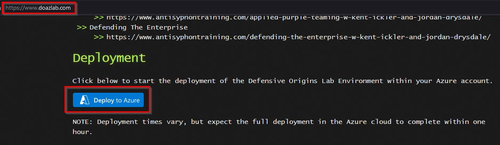

Or, you can view the operations in more detail on Github:
[DOAZLab-Github][DOAZLab-Github]

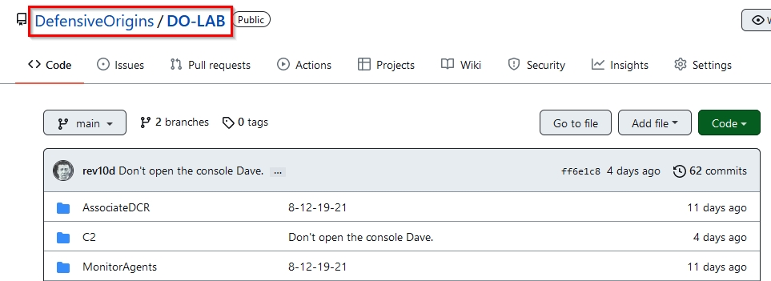

And, deploy via the README with one click!! 

**Be sure you are in a browser session you are either comfortable authenticating to Azure or you already have an authenticated session.**

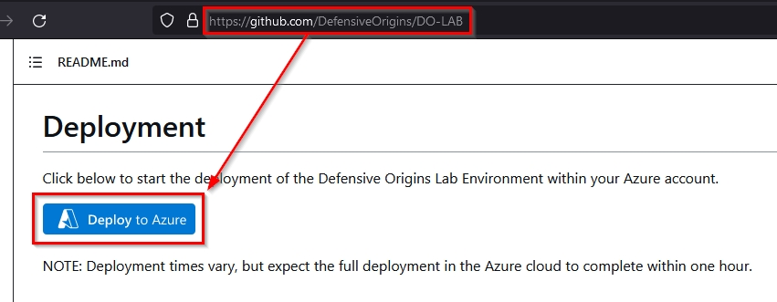

Next up you will choose your subscription, resource group, and log analytics workspace. For easy deployments and cleanup, a general recommendation is to create a new resource group and log analytics workspace. 

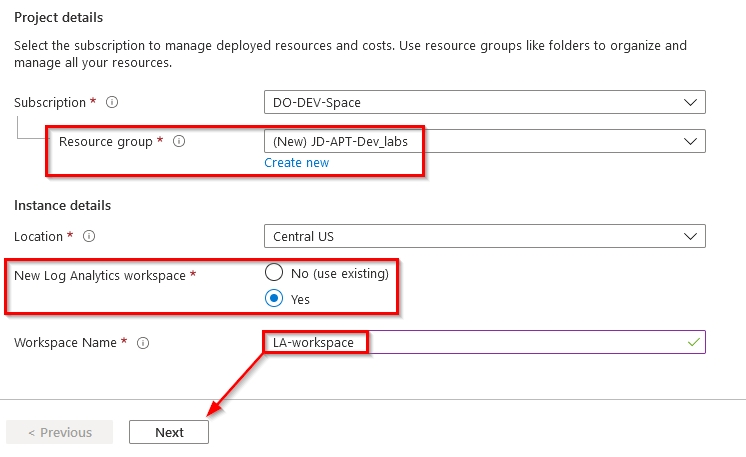

Feel free to modify the size of your VMs should you so choose. The default selections made for this course have been tested thoroughly and represent a balance of performance and cost. 

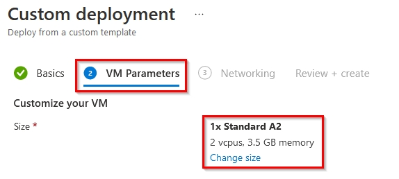

The next step in your custom deployment is to confirm the public IP space. Feel free to limit this range more specifically to your known and trusted addresses. 

**Please be aware that a demonstration will be provided and a discussion around this exposure and that leaving this address wide open (0.0.0.0/0) presents an interesting perspective of the Internet and the risks of exposing services there.**

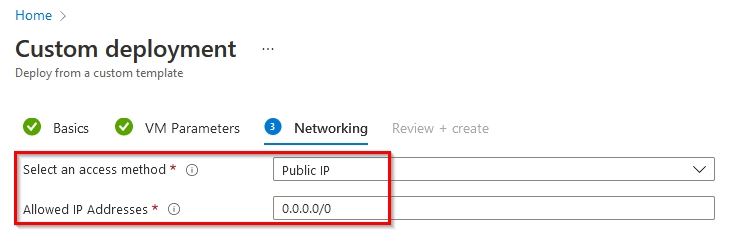

That is pretty much it for the configuration of your ARM template based deployment of the DO AZ lab environment. The next screenshot includes a warning about agreeing to the terms on Microsoft.

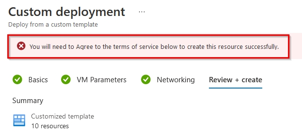

Whether you agree or not, should you choose to click Create, you implicitly do.

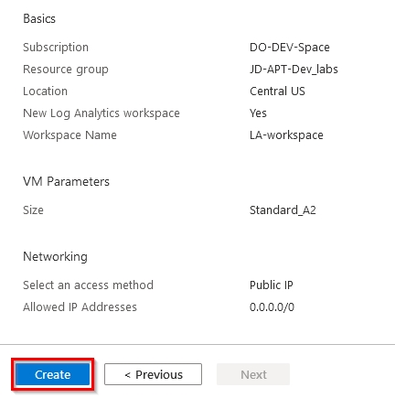

![][Div1]

### Step Three

**Connect your log sources prior to class start!**

Find your Log Analytics workspace which will depend on your naming convention and will differ from the name shown in the screen below.

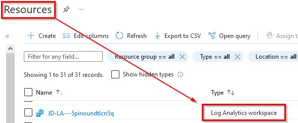

Click through to the Log Analytics workspace. Once there, scroll down and choose virtual machines under the "Workspace Data Sources" section. 

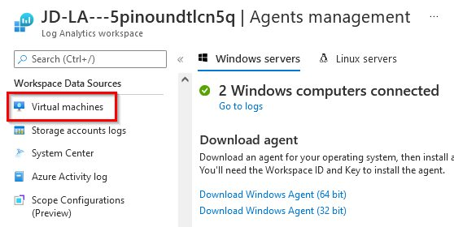

As shown below, your initial connection to the lab will require connecting each VM to the workspace.

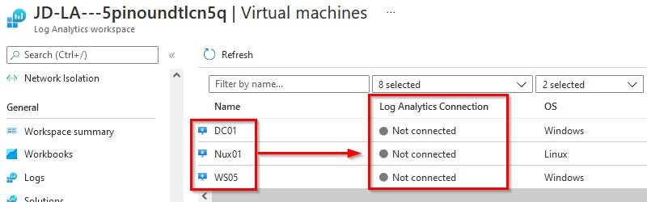

Click on each virtual and complete the initial connection process. 

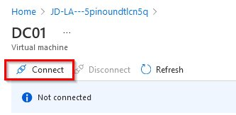

![][Div1]

### Step Four

Gather your public IP addresses. 

**https://portal.azure.com/#home --> Resource groups --> <DO_Lab_Resource_Group> --> Resources --> Filter --> "public"**

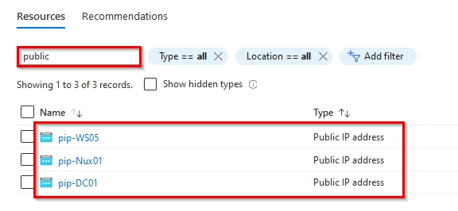

Click through each resource to gather the assigned public IP addresses.

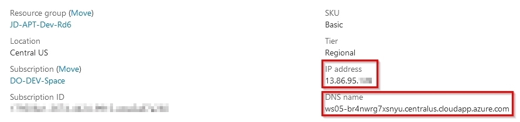

As you gather them up, document them! The addresses in the list below do not represent your IP addresses.

* DC Public IP: 13.67.200.257
* Nux Public IP: 40.86.95.257
* WS Public IP: 13.86.95.257

![][Div1]

Copyright - All Rights Reserved, Defensive Origins LLC

![][Div2]

  [Div1]: ../Z-images/divider%201.png
  [Div2]: ../Z-images/divider%202.png
  [DO]: https://www.defensiveorigins.com
  [DOAZLab]: https://www.doazlab.com
  [DOAZLab-Github]: https://github.com/DefensiveOrigins/DO-LAB
  [DOTraining]: https://training.defensiveorigins.com
  [DORegister]: https://defensiveorigins.com/first-to-know/
  [DOAboutUs]: https://defensiveorigins.com/about-us
  [WWHF]: https://wildwesthackinfest.com/
  [1]: https://defensiveorigins.com/
  [2]: https://wildwesthackinfest.com/training/
  [DOImage]:Z-images/do_darkbackground.jpg
 [Cheat-Sheets]:9-Others/Cheatsheets/
 [APTv8-DigitalBook]:AppliedPurpleTeaming-8thEdition.pdf
 [Survey]:https://forms.office.com/Pages/ResponsePage.aspx?id=ezi0P6h7Wky98F15YOOzAxFXFOo3MeNFpviudN0SuLhUMDNCT1NYWk5QWjlHUkMyMVhJVjFJTjhQMy4u
